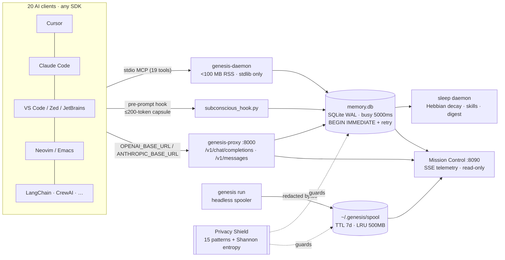

<p align="center">
  
</p>

<h1 align="center">GENESIS Memory</h1>

<p align="center">
  <strong>The persistent brain &amp; token diet for <em>every</em> AI coding agent.</strong>
</p>

<p align="center">
  
  
  
  
  
  
</p>

<p align="center">
  One local SQLite memory shared by <strong>Cursor</strong>, <strong>Claude Code</strong>, <strong>VS Code</strong>, <strong>Zed</strong>, <strong>Windsurf</strong>, <strong>JetBrains</strong>, <strong>Neovim</strong>, <strong>Emacs</strong>, <strong>OpenCode</strong>, <strong>Antigravity</strong>, every terminal agent and every SDK —<br/>
  while collapsing 4,000-line tool outputs into 84-token pointers and scrubbing secrets before they ever touch disk.
</p>

---

## Why

Every AI coding agent has the **Goldfish Effect**: each session starts from nothing. Decisions, invariants, half-finished threads and hard-won debugging insight evaporate. You repeat yourself; the agent re-reads 80k tokens of test output; your bill grows.

GENESIS is a **local-first cognitive memory OS** that sits *between* your agents and their models:

| Primitive | What it does | Who uses it |
|---|---|---|
| **MCP** (stdio) | 19 cognitive tools — `remember`, `recall`, `reinforce`, `challenge_rule`, `attest_closure`, `genesis_log`, … — or a single `genesis` gateway tool that routes them all | Cursor, Claude Code/Desktop, VS Code, Zed, Windsurf, JetBrains, Neovim, Emacs, Codex, Gemini CLI, Amazon Q, Goose, Cline, Roo, Continue |
| **Hook** (pre-prompt) | Injects a ≤200-token *subconscious capsule*: active thread, last cross-client dialogue turn, matching skills, top engrams, one recall directive | Cursor 1.7 hooks, Claude Code `PrePrompt`, OpenCode plugin, Antigravity |
| **Proxy** (stateless gateway) | `OPENAI_BASE_URL` / `ANTHROPIC_BASE_URL` → `127.0.0.1:8000`. Structural tool-pair compaction, anaphora rewriting, memory capsule injection, byte-exact SSE relay, fail-open | Any SDK, LangChain, LlamaIndex, CrewAI, AutoGen, Aider, anything with a base URL |

Everything is stdlib-only Python, runs under 100 MB RSS, stores to one WAL-mode SQLite file, and never phones home.

---

## Quick start

```bash
pip install genesis-memory          # or: git clone … && pip install -e .

genesis setup --preview             # read-only: what is installed, what would be wired
genesis setup --yes                 # wire every detected client (timestamped backups; --revert undoes)

genesis dashboard --open            # Mission Control at http://127.0.0.1:8090
genesis run -- pytest tests/        # headless, spooled, exit-code preserving
genesis doctor                      # system diagnostics, client matrix & update check
genesis upgrade                     # 1-click self-upgrade to the latest release
```

Anything not auto-detected:

```bash
genesis clients                                     # the universal matrix with detection status
genesis export-config --client zed --format native  # exact snippet in the client's own dialect
genesis export-config --format toml                 # canonical mcpServers as TOML / yaml / json / env / lua / elisp
genesis export-config --all --out ./snippets        # one file per client
```

---

## Universal client support

`genesis setup` is a **data-driven registry** (`genesis_memory/cli/client_registry.py`): each client declares where its config lives, how to detect it, which primitives it supports and how to render the patch in its own dialect. JSON/JSONC files are deep-merged (your existing servers and comments survive); YAML/TOML/Lisp/dotenv files get an idempotent `>>> genesis-memory >>>` marker block that re-runs replace and `--revert` removes.

| Client | Config | Primitives | Format |
|---|---|---|---|
| Cursor | `~/.cursor/mcp.json` + `hooks.json` | MCP · Hook · Proxy | json |
| Claude Code | `~/.claude/settings.json` + `~/.claude.json` | Hook · MCP · Proxy | json |
| Claude Desktop | `…/Claude/claude_desktop_config.json` | MCP | json |
| OpenCode | `~/.config/opencode/opencode.jsonc` + `plugins/genesis-memory.js` | MCP · Proxy · Hook | jsonc |
| Antigravity IDE | `.agents/` (native) | MCP · Hook | native |
| Windsurf (Codeium) | `~/.codeium/windsurf/mcp_config.json` | MCP · Proxy | json |
| Zed | `~/.config/zed/settings.json` → `context_servers` | MCP · Proxy | jsonc |
| VS Code (Copilot agent mode) | `…/Code/User/mcp.json` → `servers` | MCP · Proxy | jsonc |
| Cline | `…/saoudrizwan.claude-dev/settings/cline_mcp_settings.json` | MCP · Proxy | json |
| Roo Code | `…/rooveterinaryinc.roo-cline/settings/mcp_settings.json` | MCP · Proxy | json |
| Continue.dev | `~/.continue/mcpServers/genesis-memory.yaml` | MCP · Proxy | yaml |
| JetBrains Junie / AI Assistant | `~/.junie/mcp/mcp.json` | MCP · Proxy | json |
| Neovim (mcphub · Avante · CodeCompanion · Copilot.lua) | `~/.config/mcphub/servers.json` (+ Lua via export) | MCP · Proxy | json / lua |
| Emacs (gptel · aidermacs · mcp.el) | `~/.emacs.d/genesis-memory.el` | MCP · Proxy | elisp |
| Aider | `~/.aider.conf.yml` | Proxy | yaml |
| OpenAI Codex CLI | `~/.codex/config.toml` | MCP · Proxy | toml |
| Gemini CLI | `~/.gemini/settings.json` | MCP | json |
| Amazon Q Developer CLI | `~/.aws/amazonq/mcp.json` | MCP | json |
| Goose (Block) | `~/.config/goose/config.yaml` | MCP · Proxy | yaml |
| Any SDK / framework (LangChain, LlamaIndex, CrewAI, AutoGen, OpenAI, Anthropic) | `~/.genesis/genesis.env` | Proxy | env |

```python
# Zero code changes for any framework: point the base URL at the gateway.
from openai import OpenAI
client = OpenAI(base_url="http://127.0.0.1:8000/v1", api_key="not-needed")
```

---

## Architecture



### Repository layout

```text
genesis_memory/
├── core/
│   ├── db.py                 # WAL + busy_timeout + BEGIN IMMEDIATE + jittered retry (shared by every process)
│   ├── privacy_shield.py     # structural patterns + Shannon-entropy detector; redact()/scan()/redact_bytes()
│   ├── hebbian_engine.py     # stability τ, decay, reinforcement
│   ├── skill_synthesizer.py  # recurring outcomes → procedural skills
│   ├── ast_edge_extractor.py # dependency closure for attest_closure
│   ├── licensing.py          # offline HMAC-SHA256 tiers
│   └── team_sync.py          # enterprise vector-clock sync
├── daemon/server.py          # stdio MCP daemon · versioned schema · lock-storm resilient dispatch
├── hooks/subconscious_hook.py# ≤200-token capsule, ambient turn capture
├── proxy/                    # aiohttp gateway (OpenAI + Anthropic), compactor, distiller, pricing engine (+ bundled catalog)
├── cli/
│   ├── run.py                # genesis CLI · 60+ toolchain headless spooler
│   ├── client_registry.py    # universal data-driven client matrix (20 specs, aliases, dialect renderers)
│   ├── config_formats.py     # dependency-free JSON/YAML/TOML/env emitters + marker-block merger
│   ├── export_config.py      # genesis export-config / genesis clients
│   ├── init_cmd.py           # genesis setup · preview · backup · --revert
│   └── templates/opencode_plugin.js
├── sleep/                    # consolidation cycle, digest, ledger
└── dashboard/                # Mission Control (stdlib HTTP + SSE) and static/index.html cockpit
site/                         # React 19 + Vite 7 landing page with live interactive demos
tests/                        # 421 tests: chaos, concurrency, multi-process, privacy, clients, dashboard, proxy
```

---

## Capabilities

### Lossless headless spooling — `genesis run`
Wraps **60+ toolchains** (`pytest ruff mypy black tsc npm pnpm yarn bun deno cargo go dotnet gradle mvn make docker kubectl helm terraform pip uv poetry git gh …`) in a strict headless environment (`CI=1 TERM=dumb NO_COLOR=1 PAGER=cat GIT_TERMINAL_PROMPT=0 PIP_NO_INPUT=1 …`), refuses interactive shapes (`git rebase -i`, `docker run -it`, `--watch`), captures every byte to an atomic spool, prints a ≤10-line summary with a `ctx:log/<id>` pointer and preserves the exit code. Agents dereference with `genesis_log(id, grep=…)`.

### Zero-trust privacy shield
Two independent detectors — 15 structural vendor patterns (OpenAI, Anthropic, Google, GitHub, AWS, Slack, Stripe, SendGrid, npm, Hugging Face, JWT, Bearer, PEM, basic-auth URLs, `KEY=value`) and a **Shannon-entropy gate at 4.0 bits/char** for credentials with no known prefix. Git SHAs, URLs, paths and identifiers pass untouched. Applied at `remember()` (reject), thread/dialogue fields (redact), and the **spool before the atomic write** (`GENESIS_SPOOL_RAW=1` opts out).

### Bulletproof SQLite concurrency
Every connection goes through `core/db.py`: WAL journal, `busy_timeout=5000`, `synchronous=NORMAL`, `BEGIN IMMEDIATE` transaction scope, jittered exponential retry, and read-only URIs for dashboards/reports. The MCP dispatcher rolls back and retries a tool call that loses a write race. The suite runs 8 threads × 25 writes and 4 processes × 15 JSON-RPC calls against one file and asserts **zero `database is locked`**.

### Stateless gateway — OpenAI *and* Anthropic
`POST /v1/chat/completions` and `POST /v1/messages` both get structural tool-pair compaction, memory capsule injection and streaming passthrough with TTFT preserved. Shadow mode measures without mutating. `GET /v1/telemetry`, `/v1/pricing`, `/v1/receipts/{id}`, `/v1/recovery/{id}`.

### Biomimetic sleep consolidation
Engrams carry a stability τ; retention decays as e^(−age/τ). Reinforcement widens τ, contradiction narrows it, dormant engrams are tombstoned, recurring wins are distilled into skills, and a bounded Active Digest primes the next session.

### Mission Control dashboard — `genesis dashboard`
Zero-dependency cockpit on `:8090`, streaming `/api/stream` SSE: token/dollar diet ticker, orbital **Memory Universe** (drag · zoom · inspect · reinforce), BM25 **Engram Explorer** with keyboard navigation, **Conflict Deck** (accept / keep / dismiss), **Skill Browser**, Hebbian **Sleep** curves, **Client Mesh** with live detection, **Privacy Shield sandbox**, spool & ledger, and a `⌘K` command palette. Read-only over WAL; every action is an explicit audited POST.

---

## MCP tools

| Tool | Purpose |
|---|---|
| `remember` / `recall` / `forget` / `invalidate` | Episodic store with FTS5 BM25 ranking, utility scoring, supersession |
| `reinforce` | Hebbian +1 / −1 from outcomes |
| `challenge_rule` / `resolve_conflict` | Propose a better rule; human veto queue |
| `thread_update` / `thread_get` | Unified cross-client active work thread |
| `dialogue_update` / `dialogue_get` / `cross_client_resolve` | Cross-client conversational continuity with provenance |
| `synthesize_skill` / `skill_recall` | Procedural memory |
| `get_dependencies` / `attest_closure` | AST dependency closure attestation |
| `genesis_log` | Dereference spooled output (grep / pagination / chunked) |
| `sleep_now` / `status` | Consolidation trigger; health & counters |
| `genesis` | One-tool gateway: `{op: "recall", query: …}` routes every op above |

Set `GENESIS_MCP_TOOL_MODE=gateway` to advertise only the gateway tool and shrink every-turn schema bytes.

---

## Benchmarks (reference machine, `tests/`)

| Scenario | Before | After | Δ |
|---|---|---|---|
| `pytest` run, 4,000 lines in agent context | ~79,200 tok | 84 tok | **−98.4 %** |
| Subconscious capsule vs. whole store | 21,480 tok | 176 tok | **−99.2 %** |
| 14-turn conversation + 2,200 tool lines via gateway | 60,800 tok | 3,030 tok | **−95.0 %** |
| Recall latency @ 10k engrams | — | < 50 ms | — |
| Daemon RSS steady state | — | ≈ 30 MB | budget 100 MB |
| 8 procs × concurrent writes to one DB | — | 0 lock errors | — |

---

## Testing

```bash
python -m pytest tests/                     # 421 passed, 1 skipped
python -m pytest tests/test_db_hardening.py # multi-thread + multi-process lock storm
python -m pytest tests/test_privacy_shield.py tests/test_universal_clients.py tests/test_dashboard_server.py
```

---

## Licensing

Source-available under the Business Source License 1.1 (free for individuals,
teams under 10, and all non-production use; converts to MIT on 2029-09-11).
Versions ≤ v0.6.1 stay MIT forever. See LICENSE.

Offline-first HMAC-SHA256 — works air-gapped.

| | Community | Developer Pro | Enterprise Gateway |
|---|---|---|---|
| Price | Free / Community | $14 mo · $12 annual | $39 seat/mo · $32 annual |
| Local SQLite memory · hook · spooler · 20-client setup · privacy shield | ✅ | ✅ | ✅ |
| High-ratio compactor · Hebbian sleep · dashboard · live pricing · Anthropic route | — | ✅ | ✅ |
| Team shared memory sync · on-prem Docker gateway · audit logs · SLA | — | — | ✅ |

```bash
genesis auth --key GEN-PRO-<key>
genesis license
```

---

## Links

- [RELEASE_CHANGELOG.md](RELEASE_CHANGELOG.md) — every change in v0.5.0, with rationale and impact
- [docs/ARCHITECTURE.md](docs/ARCHITECTURE.md) · [docs/MCP_SPEC.md](docs/MCP_SPEC.md) · [llms.txt](llms.txt) · [openapi.json](openapi.json)
- Landing page: `cd site && npm install && npm run build && npm run preview` → http://localhost:4173

<p align="center"><sub>GENESIS Memory — because your AI agent deserves a brain that doesn't reset every session.</sub></p>
