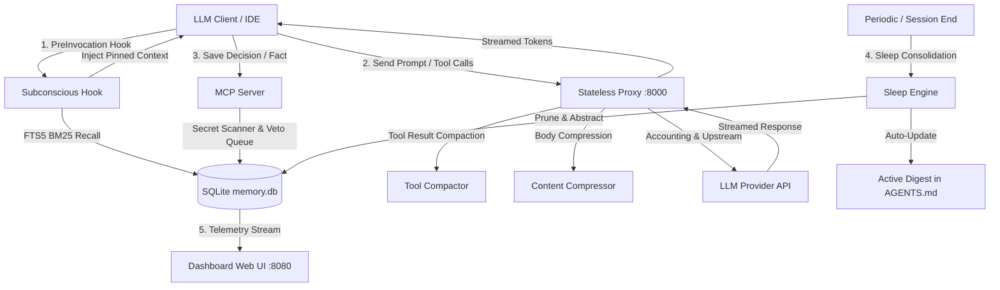

# 🧠 GENESIS Memory Architecture

## 1. Core Philosophy: The Rule of Three
> **Memory is only valuable when it replaces an action, not when it adds overhead to the context.**

Traditional agent memory systems blindly append conversation logs or vectorized chunks to the context window, causing exponential token cost escalation and diluting attention (the "needle in a haystack" problem).

GENESIS Memory operates under three foundational pillars:
1. **First-Order Epistemic Priority:** Grounded architectural decisions, verified facts, and project invariants take precedence over general model training biases.
2. **Stateless Transformation:** LLM clients remain stateless. The prompt proxy strips verbose tool payloads and compresses message bodies dynamically without mutating the client's session state.
3. **Biological Memory Consolidation:** Memory is divided into:
   - **Working Memory / Subconscious Buffer:** Pre-invocation injection of the active work thread, uncompacted recent dialogue, and relevant decisions.
   - **Episodic Ledger (`ledger.jsonl`):** Append-only raw trace of session receipts, actions, and observations.
   - **Semantic Knowledge (`memory.db`):** Consolidated, deduplicated, and audited high-order decisions stored in an ultra-compact SQLite FTS5 database (<100MB RSS budget).

---

## 2. Component Pipeline

---

## 3. Storage Invariants & Security
- **Strictly Local:** SQLite with WAL mode enabled. Zero external network calls for memory storage.
- **Fail-Closed Secret Scanner:** All content passed to `remember()` passes through sub-millisecond regex filters blocking API keys (OpenAI, Anthropic, AWS, GitHub) and private key PEM blocks.
- **Audited Tombstoning:** Memories are never silently destroyed. `forget()` marks them with tombstone markers preserving auditability.
